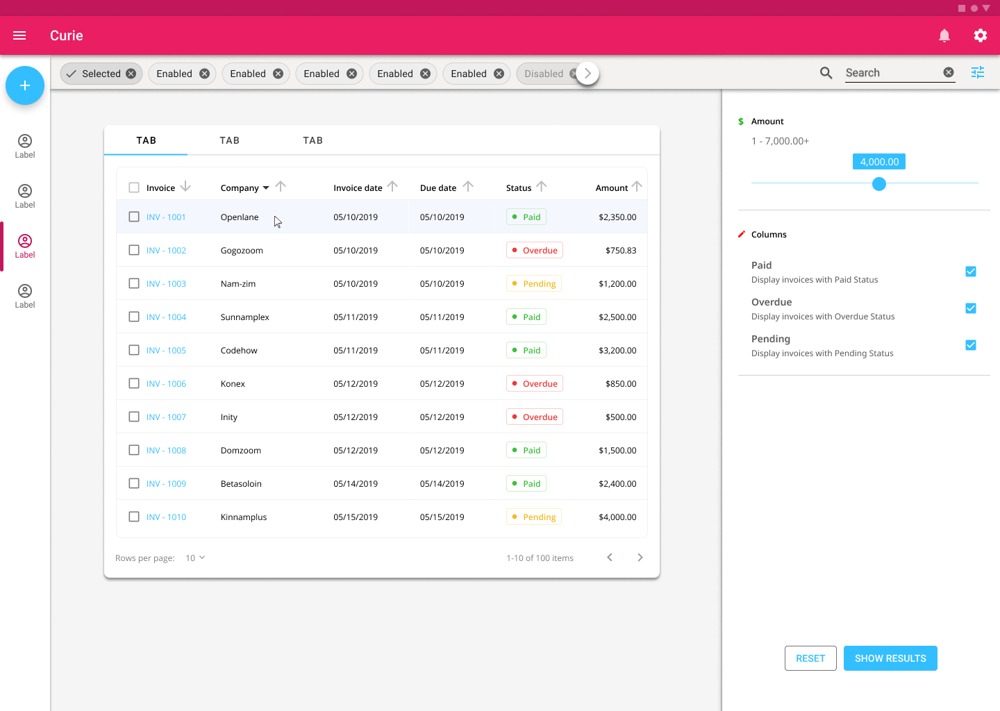

# Curie (Pre-Alpha)


## Concept

<h1 align="center">
    
</h1>

## About

- A app created to be my template.
- Licensed under [GPL-2.0 license](https://opensource.org/licenses/GPL-2.0)

> It's FREE -> "Free as in freedom"

### Versioning

- This project implements an opinionated interpretation of [Calendar Versioning](https://calver.org/).

```bash
        + YEAR                                  + YEAR
        |                                       |
        |  + MONTH OF THE YEAR                  |  + DAY OF THE YEAR
        |  |                                    |  |
        |  |  + DAY                             |  |  + DAY
        |  |  |                                 |  |  |
        |  |  | + FIX ITERATION                 |  |  |   + RELEASE CANDIDATE ITERATION
        |  |  | |                               |  |  |   |
     2022.03.14+2                            2022.03.14-rc1

     ^ RELEASE                             ^ RELEASE CANDIDATES
```

### Pull Request

- Clearly describe what you aim to add or fix.
- Try to minimize code changes and use existing style/functions.

### Reporting Issues and Bugs

To better respond to issues please follow these general guidelines when explaining the problem.

1. Clearly describe what you aim to fix, if relevant attach output/logs/screenshots.
2. Describe how developers can reproduce the bug.
